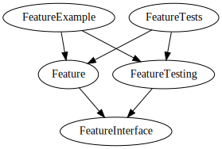
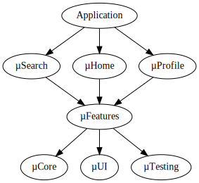

theme: Stream
slidenumbers: true
slidecount: true

# Micro/feature frameworks. What, why and how?

---

# About me
 
- Software developer since 2002, iOS since SDK v. 3
- Worked on several apps B2C, B2B
  - ING Banking, Nyon, Achmea, SurfNet, Multiple small apps
  - CocoaHeadsNL apps
- Team lead role 2018 - 2021
  - Wrote a book based on my experience
- Since November 2021
Developer Relations Engineer iOS at Stream
  
---

# Follow me on Twitter

# Check my podcast

---

[https://getstream.io/team/](https://getstream.io/team/#jobs)
 
---

# Topics

- What?
  - Micro/feature frameworks and apps
- Why?
  - Compile time
  - Reflect team structure and responsibilities
- How?
  - Using Frameworks
  - Many targets
  - Tool support

---

# What are Micro Frameworks and Feature Frameworks?

First of all, is there a difference?

I think it is interchangeable and mostly depends on what you are comfortable with.

It is a way of thinking and structuring your project.

Based on the concept of microservices. 

---

# A Micro Feature is composed of several Frameworks

You split your implementation in a way that makes sense to you.

Each feature could be implemented by these frameworks:

- Source
- Interface
- Tests
- Testing
- Example

---

# A Micro Feature is composed of several Frameworks

---

# Composing several features into a app

---

# Why split up your codebase in Frameworks?

- Compile time
- Separation of concerns, battle scaling issues
- Allows for defining API levels and boundaries

---
## Compile time

- Let's be honest.
  - You also define way to much as being public or have default scope

---
  
## Compile time

- Many codebases is one big pile of sourcecode
  - When compiling, all your code and dependencies are in scope during compilation and linking
    - Lots and lots of work

---

##   Compile time

- Creating frameworks decreases the amount of code that can "see" each other during compilation.
  - Provided you put some constraints in place.
    - Default scope helps you here, since it is package private

- Just creating and properly scoping your Frameworks potentially cuts your compile time in half. If not more. No joke.

---

## Separation of concerns, battle scaling issues

Having scaling issues within a codebase/project is a good thing

- But how do you reflect team boundaries in you code?
- How to separate features in your code?

With Frameworks :smile:
  
---

## Allows for defining API levels and boundaries

You can also use Frameworks to clearly define API levels and boundaries

- Besides features, create frameworks for
  - networking
  - authentication
  - storage
  - etc.
- Easy encapsulation and isolation of
3rd party dependencies
  - Put it in a framework and do not call on it directly
    from anywhere BUT the framework

---

## Allows for defining API levels and boundaries

- When using frameworks scope becomes much more useful
- Code level API documentation integrated very well in Xcode.
- Easy caching and pre-building of parts of the entire codebase

---

# How to work with Frameworks?

Did you ever create a Framework in Xcode manually?

It takes some effort right?

---

# How to work with Frameworks?

Creating Frameworks manually is very tedious and error prone.

How to 
- do it right
- keep things consistent
- make sure it is easy to create additional Frameworks?

---

# How to work with Frameworks?
### This is where Tuist comes in.

- CLI
- Generates Xcode projects
- Define you project structure and settings in Swift
- No more Xcode project file conflicts, ever.

---

# Demo

Let's have a look at Tuist and see how simple it is

^ `mkdir demo`
^ `tuist init --platform ios`
^ `tuist generate`

---

# Demo

Do you remember this picture?

Let's see how this looks in Tuist.

---

# Combining everything

- We talked about
  - Feature Framework clusters
  - Feature composition

But each feature is composed of several Feature Framework specific Targets

- Source, Interface, Tests, Testing, Example
  
---

## Demo

Remember these two? Let's combine these two…

 

This should result in 30 targets.

^ Open full sample
^ `tuist edit`
^ `tuist graph`
^ `tuist graph -t`
^ `tuist generate --open`
^ `Show overview`

---

# How to create consistency?

- Templates and abstraction
  - This is where all of your Swift skills come in

---

## Demo

---

# What about Bazel or Buck?

Both are great tools. But they are also complex.

Tuist fills the gap between straight forward Xcode projects and having budget to create dedicated teams to support your builds.

I have looked at all three. Tuist has the deepest and best integration with tools surrounding Apple's Xcode IDE. 

---

# Stream supports Tuist

We at Stream think Tuist is a great idea.
We now sponsor the ongoing development of Tuist.

Check them out, learn about their approach, unlock true scaling of your Xcode based codebase.

---

# Questions?

---

References

[https://tuist.io/](https://tuist.io/)
[https://docs.tuist.io/building-at-scale/microfeatures](https://docs.tuist.io/building-at-scale/microfeatures)
[https://increment.com/mobile/microapps-architecture/](https://increment.com/mobile/microapps-architecture/)
[https://github.com/AppForce1/talk-micro-frameworks](https://github.com/AppForce1/talk-micro-frameworks)
